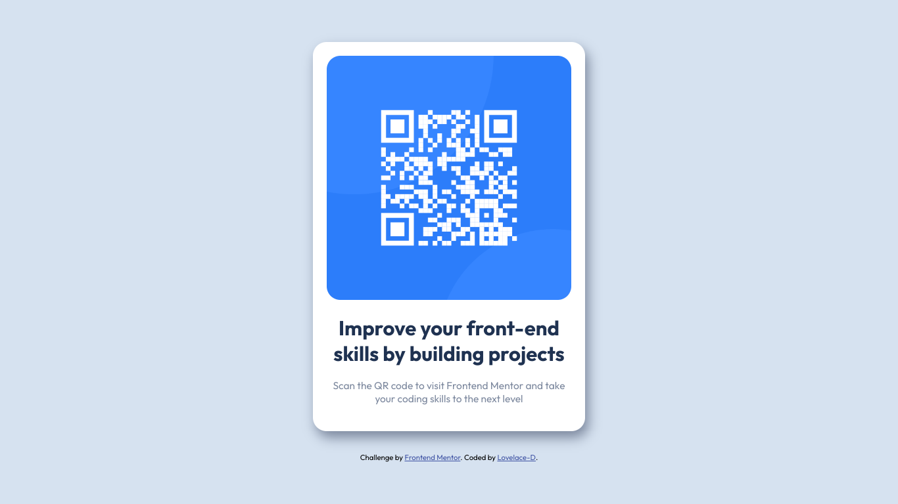

# Frontend Mentor - QR code component solution

## Table of contents

- [Overview](#overview)
  - [Screenshot](#screenshot)
  - [Links](#links)
  - [Built with](#built-with)
- [Author](#author)

### Screenshot

### Links

- Solution URL: [https://github.com/Lovelace-D/qr-code.git]
- Live Site URL: [[Add live site URL here](https://lovelace-d.github.io/qr-code/)

### Built with

- Semantic HTML5 markup
- CSS custom properties
- Flexbox

## Author

- Frontend Mentor - [@Lovelace-D](https://www.frontendmentor.io/profile/lovelace-d)
- Twitter - [@_dhieu](https://www.twitter.com/_dhieu)
